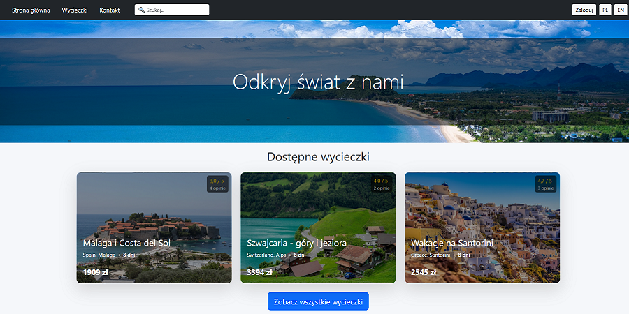
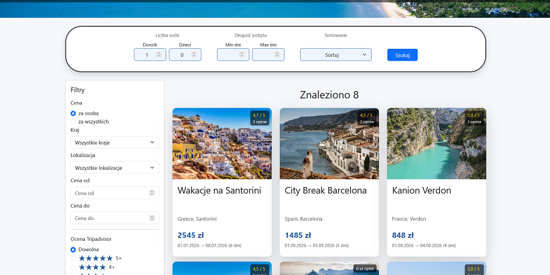
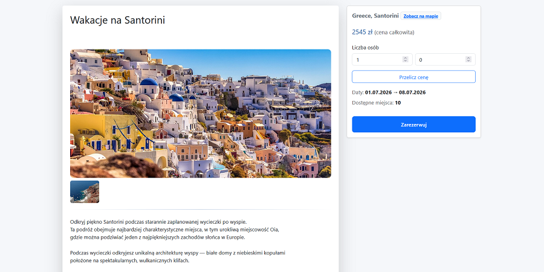

# Travel Agency (Django)

Full-stack Django web application for browsing and booking trips with availability control, filtering, and user management.

## Features

- Browse trips with images and descriptions
- Booking system with overbooking protection
- Dynamic price calculation (EUR / PLN)
- Available places tracking
- Advanced filtering (country, price, rating, duration)
- Search and sorting
- Multi-language (PL / EN)
- User bookings panel
- Basic test coverage for booking logic, availability, and filtering

## Tech Stack

- Python, Django
- PostgreSQL (production), SQLite (local development)
- Bootstrap
- Django Templates
- Django REST Framework (read-only API for trips)

## Screenshots





## Run locally
```bash
git clone https://github.com/piotrgolebiewski07/travel_agency.git
cd travel_agency

python -m venv .venv
.venv\Scripts\activate  # Windows

pip install -r requirements.txt
python manage.py migrate
python seed_data.py
python manage.py runserver
```
## Open in browser

http://127.0.0.1:8000/

## Seed data
The project includes a seed script (seed_data.py) which populates the database with sample trips and reviews.

This ensures the application has realistic demo content after setup or deployment.

---

## Deployment (Render)
Start Command:
```bash
python manage.py migrate && python seed_data.py && python manage.py collectstatic --noinput && gunicorn config.wsgi
```
Environment variables:
```env
SECRET_KEY=your_secret_key
DEBUG=False
ALLOWED_HOSTS=your-domain.onrender.com
```
---
## Tests
Basic test coverage for booking logic and filtering is included.
```bash
python manage.py test
```
## 🌍 Demo
https://travel-agency-u5y1.onrender.com/

## Demo account
Use this account to test reviews.

> ⚠️ The app may take a few seconds to start on first visit (Render free tier).

Login: demo  
Password: demo123

## Key Concepts

- Django ORM with annotations (average rating, filtering)
- Overbooking protection logic
- Server-side rendering with Django templates
- REST API with Django REST Framework
- Deployment on Render with environment configuration
